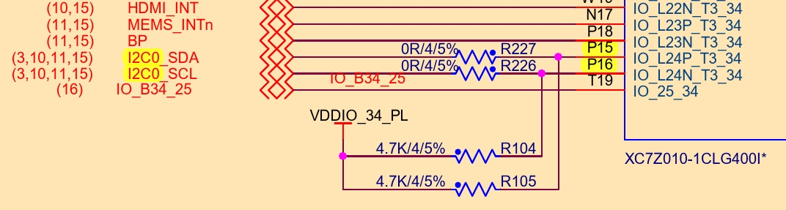
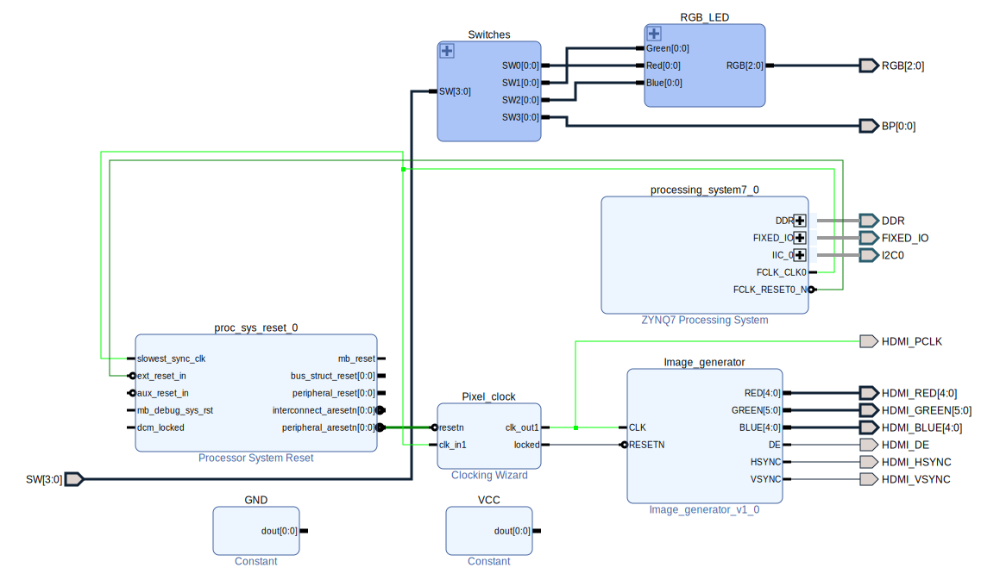
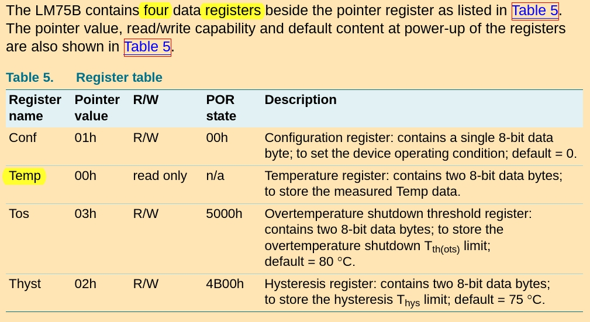

# Zynq.Temperature.Z-turn.LM75BD

Interfacing the LM75BD [temperature sensor] on a Zynq board with the name "Z-turn".

# Preliminary

## Temperature sensor

The temperature sensor, on board, is **LM75B** ([NXP link](https://www.nxp.com/part/LM75BD)):

It's an 11-bit ADC (with increments of **0.125**°C)

The 7-bit [I2C] address (taken from the previous picture) is **0x49**.

It is connected to **I2C0**, which is connected to **PL** pins P15 & P16. The provided **contraints** file has been set up.

For those new to [Zynq][Zynq], some pins are accessed through the [PS][PS] part while others through the [PL][PL]. (Pins of the former, have names like [MIO51][MIO]. This is what makes [Zynq][Zynq] special, splitting the workload between the [hard processor][PS] and the [programmable logic][PL]).

# I2C

Even though it's possible to handle I2C entirely in the PL (excluding the PS), we'll stick with using the PS's native, **embedded I2C** controller.

Accordingly, the library that'll be used is the [I2C-PS](https://xilinx-wiki.atlassian.net/wiki/spaces/A/pages/18841822/I2C-PS+standalone+driver), with the respective [API](https://xilinx.github.io/embeddedsw.github.io/iicps/doc/html/api/index.html).

*(Ideas will be taken from the [xiicps_polled_master](https://github.com/Xilinx/embeddedsw/blob/master/XilinxProcessorIPLib/drivers/iicps/examples/xiicps_polled_master_example.c) example).*

# Code

The sensor's [temperature] register, is at address **00h**.

(All code has been provided). The following sums up the [PS][PS] part:

Initialization:

1. XIicPs_LookupConfig(XIICPS_BASEADDRESS);
2. XIicPs_CfgInitialize(&Iic, ConfigPtr, ConfigPtr->BaseAddress);
3. XIicPs_SelfTest(&Iic);
4. XIicPs_SetSClk(&Iic, IIC_SCLK_RATE);

Reading temperature:

1. XIicPs_BusIsBusy(&Iic)
2. XIicPs_MasterSendPolled(&Iic, const_cast<uint8_t*>(v.data()), v.size(), SLAVE_ADDRESS);  -- Send register address (00h)
3. XIicPs_BusIsBusy(&Iic)
4. XIicPs_MasterRecvPolled(&Iic, result.data(), result.capacity(), SLAVE_ADDRESS);  -- Read register's (00h) value

[PL]: ## "Programmable Logic"
[PS]: ## "Processing System"
[MIO]: ## "Multiplexed I/O"
[Zynq]: https://www.amd.com/en/products/adaptive-socs-and-fpgas/soc/zynq-7000.html