# [Zynq.Z-turn](https://github.com/Spyros667/Zynq.Z-turn) (in progress)

The [z-turn][z-turn] board, is a [Zynq][Zynq] [PCB][PCB], featuring multiple peripherals:

Some are accessed through Zynq's [PS][PS] part, while others through its [PL][PL].

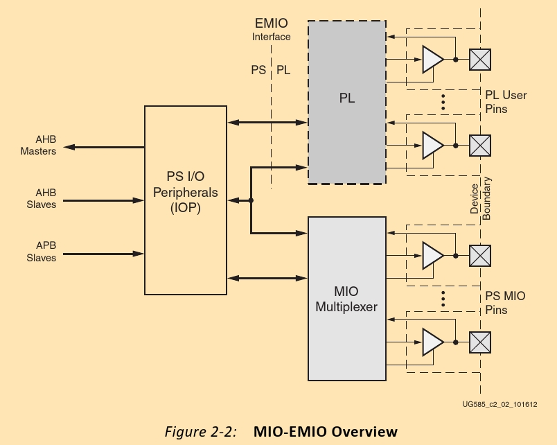

## Contents

* ### [Block design](#Block-design-1)
<!-- -->
1. ### [HDMI](#HDMI-1)
2. ### [Activating Sil9022A](#Activating-Sil9022A-1)
3. ### [Raising RESETn](#Raising-RESETn-1)
<!-- -->
* ### [Temperature sensor](#Temperature-sensor-1)
* ### [GPIO](#GPIO-1)
* ### [I2C](#I2C-1)
* ### [Referencies](#Referencies-1)

---

## Block design

---

## HDMI

In order to find, where the HDMI is connected to, we can reference the [schematics](docs/zturnv2Schematic.pdf).  
According to these, they are connected to the [PL][PL] part (since [PS][PS] pins would be numbered like [MIO_#][MIO]).

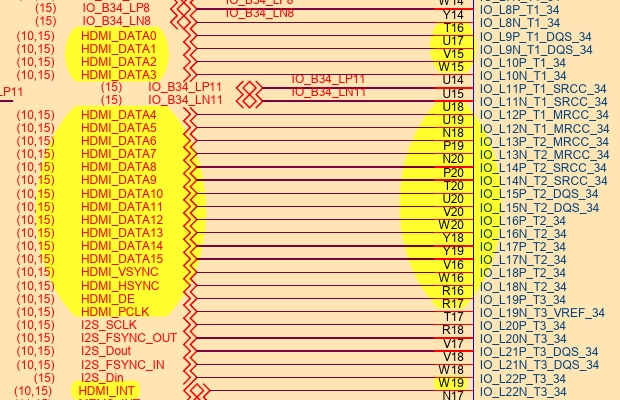

Looking further down [the schematics], we see that the signals pass through an "HDMI transmitter".

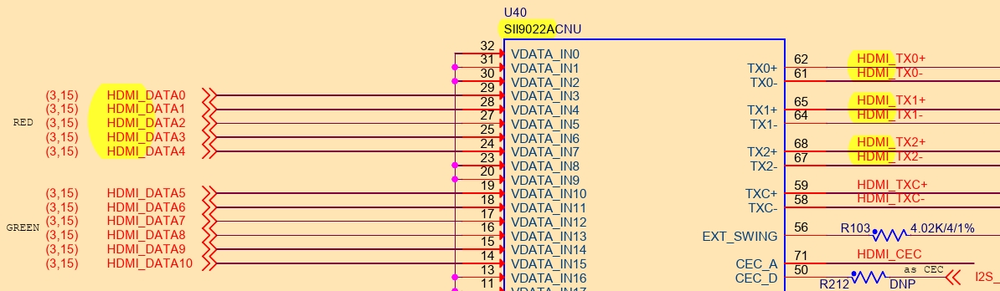

As a result, we have to power up the transmitter. In order to do so, we see that it communicates through the I2C-0 bus, thus we'll need an I2C interface to do so.

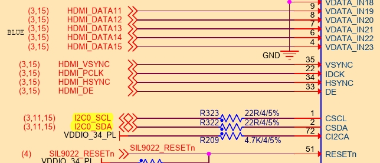

I2C-0 is connected to PL as `P15` & `P16`

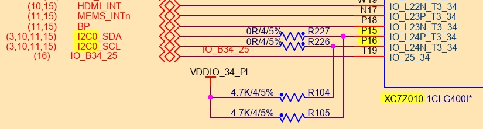

## Activating Sil9022A

The minimal configuration needed is the following:

1. Raise the `RESETn` signal [to power up Sil9022A]
2. Write `0x00` to register `0xC7`, in order to enable the TPI (Transmitter Programming Interface)
3. Wait for ID to stabilize (at `0x1B-1D, 30`).
4. Enable source termination (might be unnecessary, depending on the schematic/ external resistors)
5. Disable TMDS output (at `0x1A`) (default)
6. Switch from D2 to D0 state (at `0x1E`)
7. Enable TMDS output (at `0x1A`)

### I2C Address

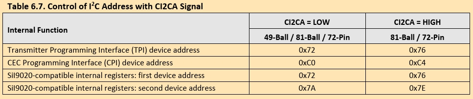

It's important to note that the address is **0x3B**. This derives from **0x76 >> 1**, which means that the datasheet depicts the **8-bit** versions.

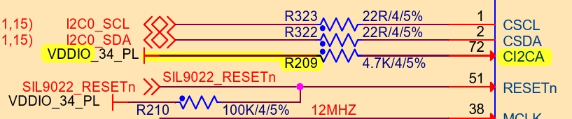

Needless to say, **CI2CA** has been raised (assuming **R209** is in place).

## Raising RESETn

Searching through the schematics for the **RESETn** pin, we can see it's connected to **MIO51**. (The signal passes first through a **buffer** and then through an **AND** gate).

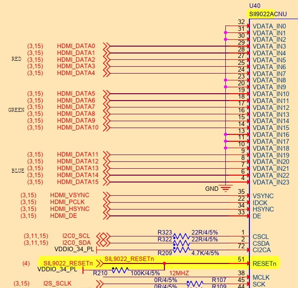
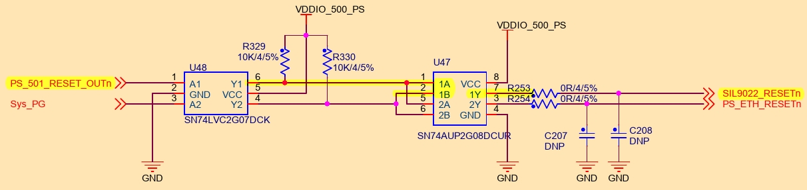
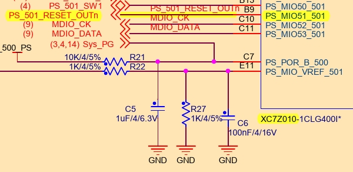

---

## Temperature sensor

The temperature sensor, on board, is **LM75B** ([NXP](https://www.nxp.com/part/LM75BD)):

It's an 11-bit ADC (with increments of **0.125**°C)

The 7-bit [I2C] address is **0x49**.

It is connected to **I2C0**, which is connected to **PL** pins `P15` & `P16`. The provided **contraints** file has been set up.

The sensor's [temperature] register, is at address **00h**. (It is **2 bytes** long).

---

## G-Sensor (acceleration sensor)

Referencing the [schematics](docs/zturnv2Schematic.pdf), the **g-sensor**, onboard, is the [adlx345](https://www.analog.com/en/products/adxl345.html) from *Analog Devices* ([datasheet](docs/adxl345.pdf)).

With **7-bit** address `53h`, over `I2C0`.

It has **3 axis** of 13 bits, which give a **resolution** of **3.9 mg**/LSB.

* Q: Can it detect [variations in earth's gravity](https://en.wikipedia.org/wiki/Gravity_of_Earth#Variation_in_magnitude)?
* A: No. **Maximum** variation is around `0.069m/s²` (0.7% ⋅ g) while we measure at `0.035m/s²` (0.36% ⋅ g) (1/282 ⋅ g).

### I2C mode (disabled SPI)

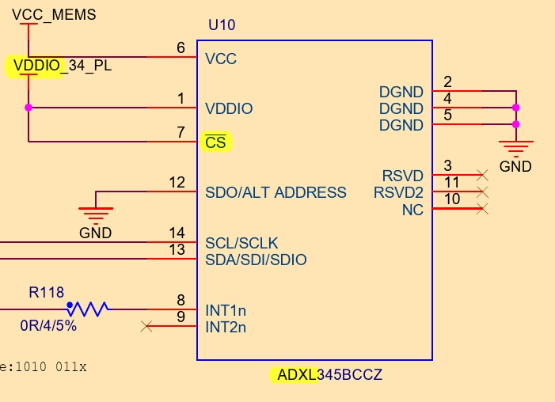

`I2C` communication mode is forced, due to `C̅S̅` being tied to `VDDIO` (high).

## Resolution

Maximum resolution can be achieved only when measuring around `±2 g`.

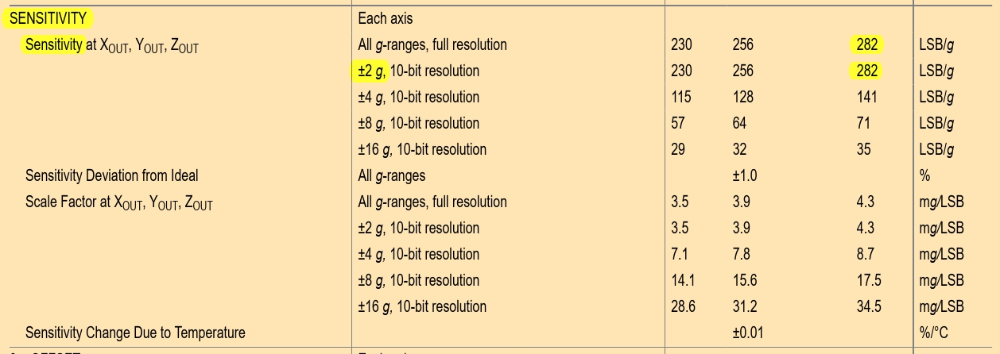

Settings are through the `0x31` register (named "DATA_FORMAT"), but they default to **full resolution**.

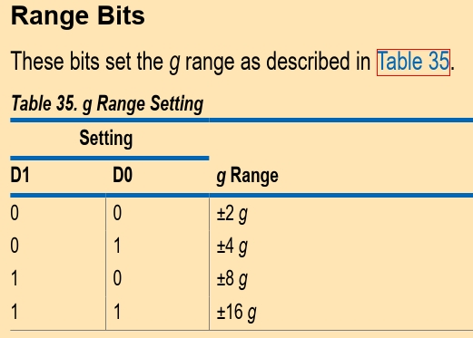

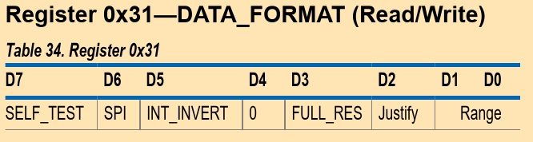

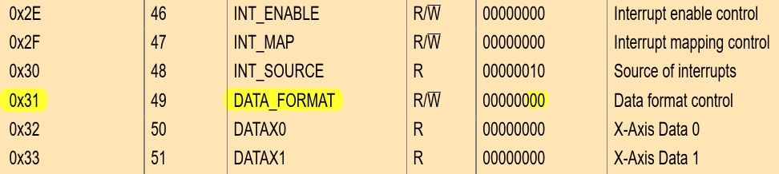

## Sampling rate

With a **default** sampling rate of `100Hz`, maximum sampling rate can be achieved by setting the `0x2C` register to `0x0F` (which translates to **1600 Hz**, due to there being 2 bytes per axis).

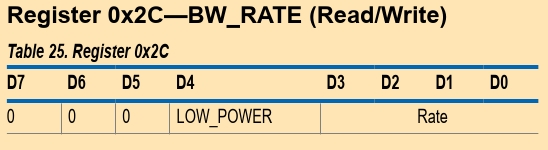

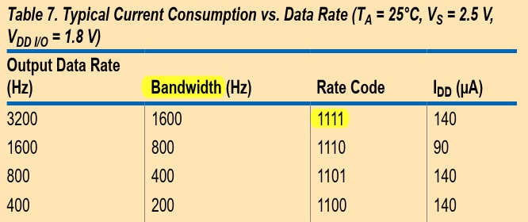

### Spectral Analysis

DECLINED:
> Doing an FFT only on the 32 samples (at maximum sampling rate) of the FIFO, would provide only 16 bins, which is too low a resolution, especially on the `1600Hz` span.

FUTURE:  
> Spectral analysis of nonuniformly sampled data can be achieved. This would be **ideal**, since it would span (?) the full spectrum of `1600Hz`. Details in the [docs/GDFT](docs/GDFT) folder.

ACCEPTED:  
> Spectral analysis relative to I/O speed. That is, for a `100kHz` I2C speed a `100Hz` sampling rate is accepted.

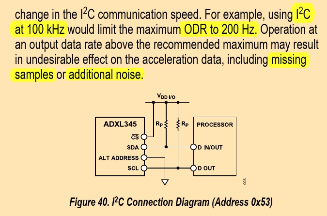

A low data rate of `100Hz` should be preferred, against higher ones, due to the latter introducing noise.

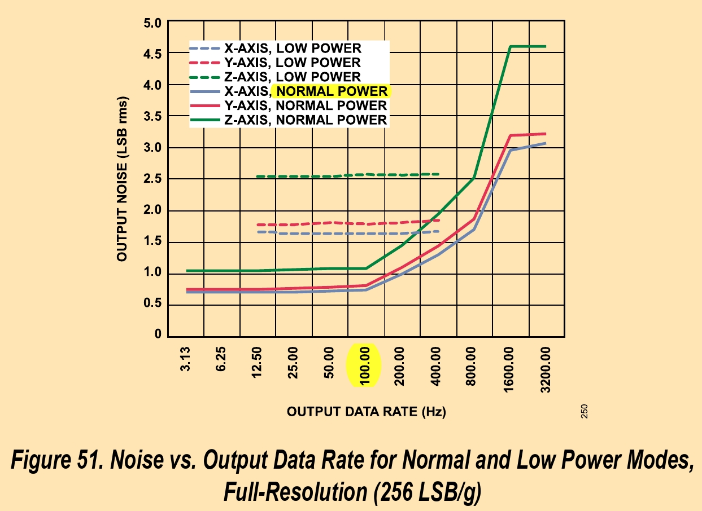

[Some] Lower (than `100Hz`) data rates should also be avoided, due to high offsetting, relative to temperature.

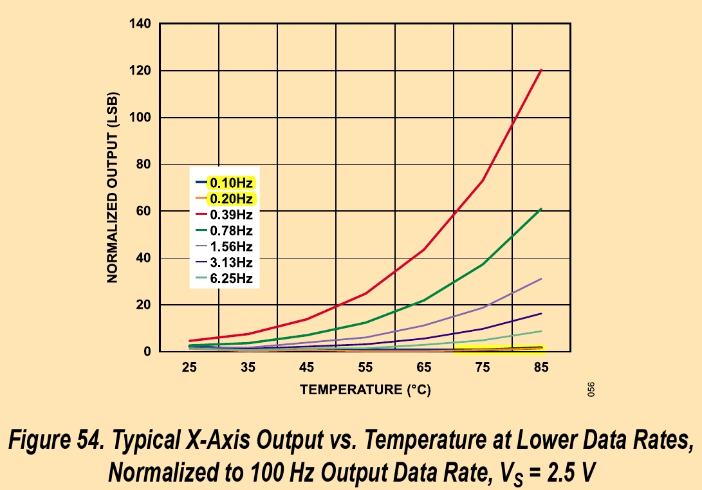

Low power [operation] should also be avoided as it introduces additional noise.

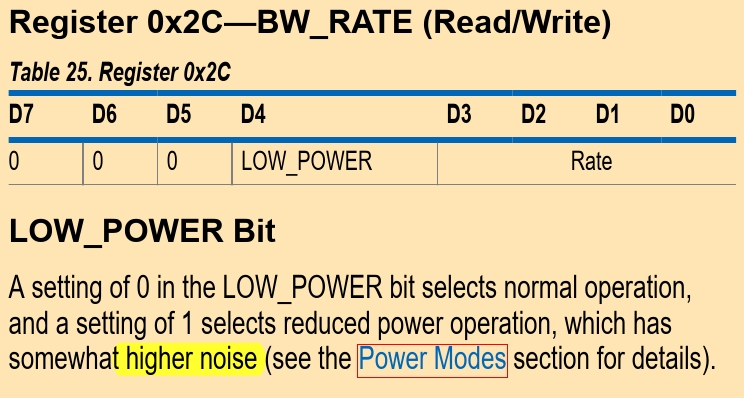

## Data

Data is stored as 3 sets of 2 bytes, at registers `0x32 to 0x37`. They should be read as a 6-byte burst, to retain concurrency.

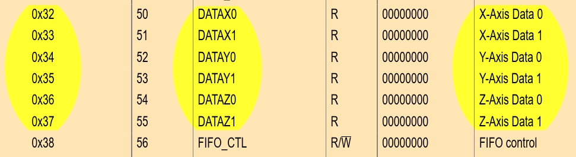

------------------------------------------------------------------------------

## GPIO

The library being used is called [**Gpio-PS**](https://xilinx-wiki.atlassian.net/wiki/spaces/A/pages/18841744/Gpio-PS+standalone+driver). [API](https://xilinx.github.io/embeddedsw.github.io/gpiops/doc/html/api/index.html).

(All code has been provided). The general procedure is the following.

Gpio is first **initialized**:

* XGpioPs_LookupConfig() ▶ Retrieves the addresses assigned to the Gpio-PS controller and the related (parent?) interrupts
* XGpioPs_CfgInitialize() ▶ Sets the XGpioPs instance's [variables](https://xilinx.github.io/embeddedsw.github.io/gpiops/doc/html/api/struct_x_gpio_ps.html).

Next the **pins are set**:

* XGpioPs_SetDirectionPin() ▶ Which sets the pin as input/output
* XGpioPs_SetOutputEnablePin()

And written:

* **XGpioPs_WritePin()**

---

## I2C

The library that'll be used is the [I2C-PS](https://xilinx-wiki.atlassian.net/wiki/spaces/A/pages/18841822/I2C-PS+standalone+driver), with the respective [API](https://xilinx.github.io/embeddedsw.github.io/iicps/doc/html/api/index.html).

(All code has been provided). The general procedure is the following.

Initialization:

1. XIicPs_LookupConfig(XIICPS_BASEADDRESS);
2. XIicPs_CfgInitialize(&Iic, ConfigPtr, ConfigPtr->BaseAddress);
3. XIicPs_SelfTest(&Iic);
4. XIicPs_SetSClk(&Iic, IIC_SCLK_RATE);

Reading:

1. XIicPs_BusIsBusy(&Iic)
2. XIicPs_MasterSendPolled(&Iic, const_cast<uint8_t*>(v.data()), v.size(), SLAVE_ADDRESS);  -- Send register address, or an array of bytes (for Page/Offset referencies).
3. XIicPs_BusIsBusy(&Iic)
4. XIicPs_MasterRecvPolled(&Iic, result.data(), result.capacity(), SLAVE_ADDRESS);  -- Read register's values

---

## Referencies

* [HDMI Made Easy: HDMI-to-VGA and VGA-to-HDMI Converters](https://www.analog.com/en/resources/analog-dialogue/articles/hdmi-made-easy.html)
* [Z-Turn board HDMI out](https://github.com/hauerdie/z-turn-board-hdmi-out)
* [various HDMI info](https://www.eaton.com/us/en-us/products/backup-power-ups-surge-it-power-distribution/backup-power-ups-it-power-distribution-resources/cpdi-vertical-marketing/hdmi-explained.html)
* [Digital Design and Computer Architecture, ARM Edition](https://shop.elsevier.com/books/digital-design-and-computer-architecture-arm-edition/harris/978-0-12-800056-4)
* [VESA timings](http://www.tinyvga.com/vga-timing)
* [Xilinx (baremetal) libraries](https://xilinx-wiki.atlassian.net/wiki/spaces/A/pages/18841745/Baremetal+Drivers+and+Libraries)
* [Gpio-PS driver](https://xilinx-wiki.atlassian.net/wiki/spaces/A/pages/18841744/Gpio-PS+standalone+driver) 🧼 [API](https://xilinx.github.io/embeddedsw.github.io/gpiops/doc/html/api/index.html)
* [I2C-PS driver](https://xilinx-wiki.atlassian.net/wiki/spaces/A/pages/18841822/I2C-PS+standalone+driver) 🧼 [API](https://xilinx.github.io/embeddedsw.github.io/iicps/doc/html/api/index.html)
* [AXI-I2C driver](https://xilinx-wiki.atlassian.net/wiki/spaces/A/pages/18841916/AXI-I2C+standalone+driver) 🧼 [API](https://xilinx.github.io/embeddedsw.github.io/iic/doc/html/api/index.html)

<!-- References/ invisible parts -->

[z-turn]: https://www.myirtech.com/list.asp?id=708
[Zynq]: https://www.amd.com/en/products/adaptive-socs-and-fpgas/soc/zynq-7000.html
[PCB]: https://en.wikipedia.org/wiki/Printed_circuit_board
[PL]: ## "Programmable Logic"
[PS]: ## "Processing System"
[MIO]: ## "Multiplexed I/O"
[EDID]: https://en.wikipedia.org/wiki/Extended_Display_Identification_Data
[CRT]: https://en.wikipedia.org/wiki/Cathode-ray_tube