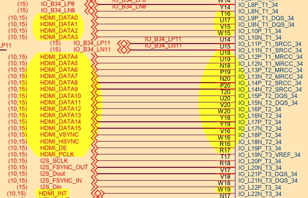

# Zynq.Z-turn

The [z-turn][z-turn] board, is a [Zynq][Zynq] [PCB][PCB], featuring multiple peripherals:

Some can be accessed through [Zynq][Zynq]'s [PS][PS] part, while others through its [PL][PL].

---

---

## HDMI

In order to find, where the HDMI is connected to, we can reference the [schematics](doc/zturnv2Schematic.pdf).  
According to these, they are connected to the [PL][PL] part (since the [PS][PS] pins are numbered as [MIO_#][MIO]).

Looking further down [the schematics], we see that the signals pass through an "HDMI transmitter".

As a result, we have to power up the transmitter. In order to do so, we see that it communicates through the I2C-0 bus, thus we'll need an I2C interface to do so.

I2C-0 is connected to PL as P15 & P16

## Activating Sil9022A

The minimal configuration needed is the following:

1. Raise the `RESETn` signal [to power up Sil9022A]
2. Write `0x00` to register `0xC7`, in order to enable the TPI (Transmitter Programming Interface)
3. Wait for ID to stabilize (at 0x1B-1D, 30).
4. Enable source termination (might be unnecessary, depending on the schematic/ external resistors)
5. Disable TMDS output (at `0x1A`) (default)
6. Switch from D2 to D0 state (at `0x1E`)
7. Enable TMDS output (at `0x1A`)

### Address

It's important to note that the address is **0x3B**. This derives from **0x76 >> 1**, which means that the datasheet depicts the **8-bit** versions.

Needless to say, **CI2CA** has been raised (assuming **R209** is in place).

## Raising RESETn

Searching through the schematics for the **RESETn** pin, we can see it's connected to **MIO51**. (The signal passes first through a **buffer** and then through an **AND** gate).

---

## Temperature sensor

The temperature sensor, on board, is **LM75B** ([NXP](https://www.nxp.com/part/LM75BD)):

It's an 11-bit ADC (with increments of **0.125**°C)

The 7-bit [I2C] address (taken from the previous picture) is **0x49**.

It is connected to **I2C0**, which is connected to **PL** pins P15 & P16. The provided **contraints** file has been set up.

The sensor's [temperature] register, is at address **00h**. (It is **2 bytes** long).

---

## Referencies

* [HDMI Made Easy: HDMI-to-VGA and VGA-to-HDMI Converters](https://www.analog.com/en/resources/analog-dialogue/articles/hdmi-made-easy.html)
* [Z-Turn board HDMI out](https://github.com/hauerdie/z-turn-board-hdmi-out)
* [various HDMI info](https://www.eaton.com/us/en-us/products/backup-power-ups-surge-it-power-distribution/backup-power-ups-it-power-distribution-resources/cpdi-vertical-marketing/hdmi-explained.html)
* [Digital Design and Computer Architecture, ARM Edition](https://shop.elsevier.com/books/digital-design-and-computer-architecture-arm-edition/harris/978-0-12-800056-4)
* [VESA timings](http://www.tinyvga.com/vga-timing)
* [Xilinx (baremetal) libraries](https://xilinx-wiki.atlassian.net/wiki/spaces/A/pages/18841745/Baremetal+Drivers+and+Libraries)
    * [Gpio-PS driver](https://xilinx-wiki.atlassian.net/wiki/spaces/A/pages/18841744/Gpio-PS+standalone+driver)
        * [API](https://xilinx.github.io/embeddedsw.github.io/gpiops/doc/html/api/index.html)
    * [AXI-I2C driver](https://xilinx-wiki.atlassian.net/wiki/spaces/A/pages/18841916/AXI-I2C+standalone+driver)
        * [API](https://xilinx.github.io/embeddedsw.github.io/iic/doc/html/api/index.html)

---

<!-- References/ invisible parts -->

[z-turn]: https://www.myirtech.com/list.asp?id=708
[Zynq]: https://www.amd.com/en/products/adaptive-socs-and-fpgas/soc/zynq-7000.html
[PCB]: https://en.wikipedia.org/wiki/Printed_circuit_board
[PL]: ## "Programmable Logic"
[PS]: ## "Processing System"
[MIO]: ## "Multiplexed I/O"
[EDID]: https://en.wikipedia.org/wiki/Extended_Display_Identification_Data
[CRT]: https://en.wikipedia.org/wiki/Cathode-ray_tube